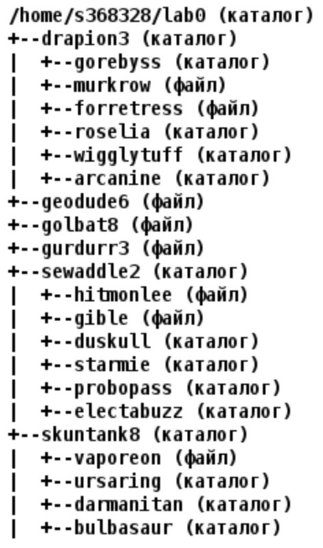
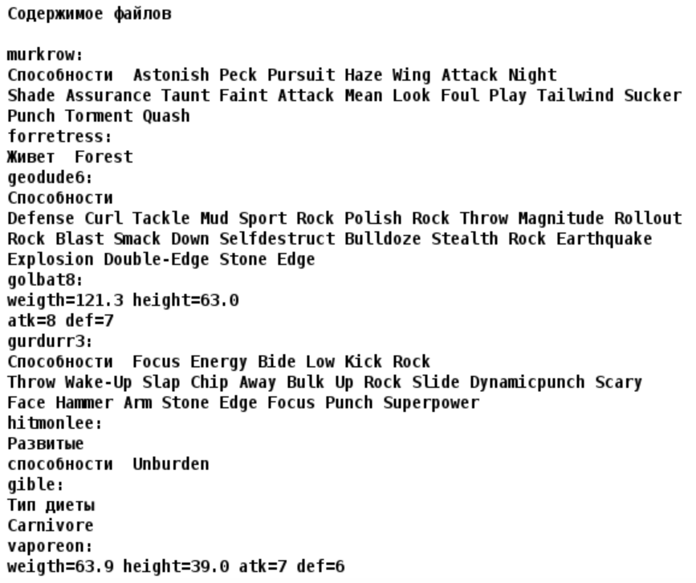

# Лабораторная работа №1

## Варинат №3111

### Отчет
[pdf](./reports/report.pdf), [docx](./reports/report.docx)

### Текст задания

1. Создать приведенное в варианте дерево каталогов и файлов с содержимым. В качестве корня дерева использовать каталог `lab0` своего домашнего каталога. Для создания и навигации по дереву использовать команды: `mkdir, echo, cat, touch, ls, pwd, cd, more, cp, rm, rmdir, mv`.

2. Установить согласно заданию права на файлы и каталоги при помощи команды `chmod`, используя различные способы указания прав.

- drapion3: права 770
- gorebyss: владелец должен записывать директорию и переходить в нее; группа-владелец должна только переходить в директорию; остальные пользователи должны только переходить в директорию
- murkrow: ------r--
- forretress: владелец должен читать и записывать файл; группа-владелец должна записывать файл; остальные пользователи должны записывать файл
- roselia: права 751
- wigglytuff: владелец должен записывать директорию и переходить в нее; группа-владелец должна читать, записывать директорию и переходить в нее; остальные пользователи должны читать директорию и переходить в нее
- arcanine: права 305
- geodude6: ---rw--w-
- golbat8: владелец должен не иметь никаких прав; группа-владелец должна читать и записывать файл; остальные пользователи должны не иметь никаких прав
- gurdurr3: владелец должен не иметь никаких прав; группа-владелец должна читать и записывать файл; остальные пользователи должны записывать файл
- sewaddle2: r-xrwx-wx
- hitmonlee: rw-r-----
- gible: ------rw-
- duskull: владелец должен читать, записывать директорию и переходить в нее; группа-владелец должна записывать директорию и переходить в нее; остальные пользователи должны записывать директорию и переходить в нее
- starmie: владелец должен читать, записывать директорию и переходить в нее; группа-владелец должна читать, записывать директорию и переходить в нее; остальные пользователи должны читать, записывать директорию и переходить в нее
- probopass: владелец должен читать, записывать директорию и переходить в нее; группа-владелец должна читать, записывать директорию и переходить в нее; остальные пользователи должны читать, записывать директорию и переходить в нее
- electabuzz: r-x--x-w-
- skuntank8: права 315
- vaporeon: права 600
- ursaring: r-xrwxrw-
- darmanitan: владелец должен читать директорию и переходить в нее; группа-владелец должна только переходить в директорию; остальные пользователи должны записывать директорию и переходить в нее
- bulbasaur: владелец должен записывать директорию и переходить в нее; группа-владелец должна только переходить в директорию; остальные пользователи должны только переходить в директорию

3. Скопировать часть дерева и создать ссылки внутри дерева согласно заданию при помощи команд `cp` и `ln`, а также комманды `cat` и перенаправления ввода-вывода.

- объеденить содержимое файлов lab0/sewaddle2/hitmonlee, lab0/sewaddle2/gible, в новый файл lab0/geodude6_67
- создать символическую ссылку c именем Copy_89 на директорию drapion3 в каталоге lab0
- cоздать символическую ссылку для файла golbat8 с именем lab0/sewaddle2/hitmonleegolbat
- скопировать файл geodude6 в директорию lab0/skuntank8/bulbasaur
- cоздать жесткую ссылку для файла geodude6 с именем lab0/skuntank8/vaporeongeodude
- скопировать рекурсивно директорию skuntank8 в директорию lab0/drapion3/roselia
- скопировать содержимое файла gurdurr3 в новый файл lab0/sewaddle2/hitmonleegurdurr

4. Используя команды `cat, wc, ls, head, tail, echo, sort, grep` выполнить в соответствии с вариантом задания поиск и фильтрацию файлов, каталогов и содержащихся в них данных.

- Подсчитать количество символов содержимого файлов: forretress, hitmonlee, gible, отсортировать вывод по увеличению количества, ошибки доступа не подавлять и не перенаправлять
- Вывести четыре первых элемента рекурсивного списка имен и атрибутов файлов в директории lab0, список отсортировать по возрастанию даты изменения записи о файле, добавить вывод ошибок доступа в стандартный поток вывода
- Рекурсивно вывести содержимое файлов из директории lab0, имя которых заканчивается на 'n', строки отсортировать по имени a->z, добавить вывод ошибок доступа в стандартный поток вывода
- Подсчитать количество символов содержимого файла gurdurr3, результат записать в тот-же файл, ошибки доступа не подавлять и не перенаправлять
- Вывести содержимое файла geodude6, оставить только строки, содержащие "Ston", ошибки доступа не подавлять и не перенаправлять
- Подсчитать количество строк содержимого файла geodude6, результат записать в файл в директории /tmp, добавить вывод ошибок доступа в стандартный поток вывода

5. Выполнить удаление файлов и каталогов при помощи команд `rm` и `rmdir` согласно варианту задания.

- Удалить файл golbat8
- Удалить файл lab0/drapion3/murkrow
- удалить символические ссылки Copy_*
- удалить жесткие ссылки lab0/skuntank8/vaporeongeodu*
- Удалить директорию sewaddle2
- Удалить директорию lab0/skuntank8/ursaring
