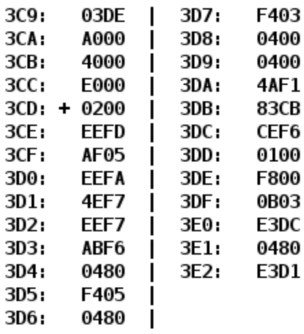

# Лабораторная работа №3

## Варинат №3108

### Отчет
[pdf](./reports/report.pdf), [docx](./reports/report.docx)

### Текст задания

По выданному преподавателем варианту восстановить текст заданного варианта программы, определить предназначение и составить описание программы, определить область представления и область допустимых значений исходных данных и результата, выполнить трассировку программы.

